# System Trace Dashboard

Real-time infrastructure monitoring dashboard with agent-based metrics, host monitoring, inventory management, and system logging.

- **Backend:** FastAPI + SQLite + `psutil`
- **Frontend:** Static HTML/CSS/JS + Chart.js (CDN)
- **Agents:** Lightweight Python agents for Linux hosts (Ubuntu, Debian, RHEL, CentOS, Rocky Linux)
- **Anomaly detection:** Rolling z-score over recent metric history

## UI Pages

| Page | URL | Description |
|------|-----|-------------|
| Dashboard | `/` | Overview, Problems, Hosts, Maps |
| Host Monitor | `/host?id=<id>` | Per-host real-time charts (CPU, RAM, Disk, Network, GPU) |
| Overview | `/overview` | System overview |
| Inventory | `/inventory` | Asset/equipment tracking (rack, shelf, S/N) |
| Configuration | `/configuration` | System configuration |
| Hosts Management | `/hosts` | Discovered hosts and agent deployment |
| System Logs | `/logs` | Filterable system event log |
| User Management | `/users` | User accounts |
| User Groups | `/user-groups` | Group-based access control |

## Screenshots

### Login
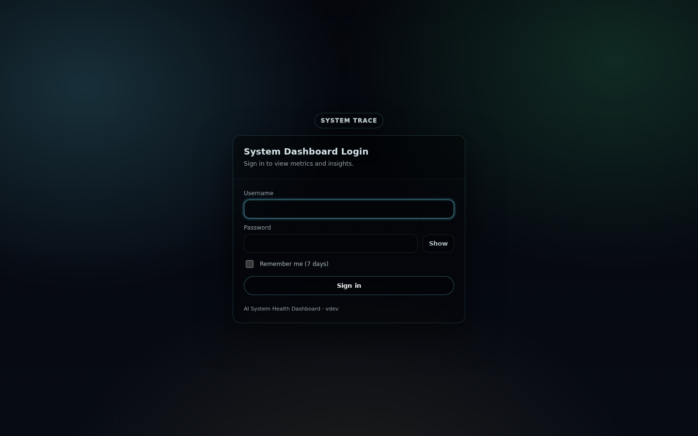

### Dashboard
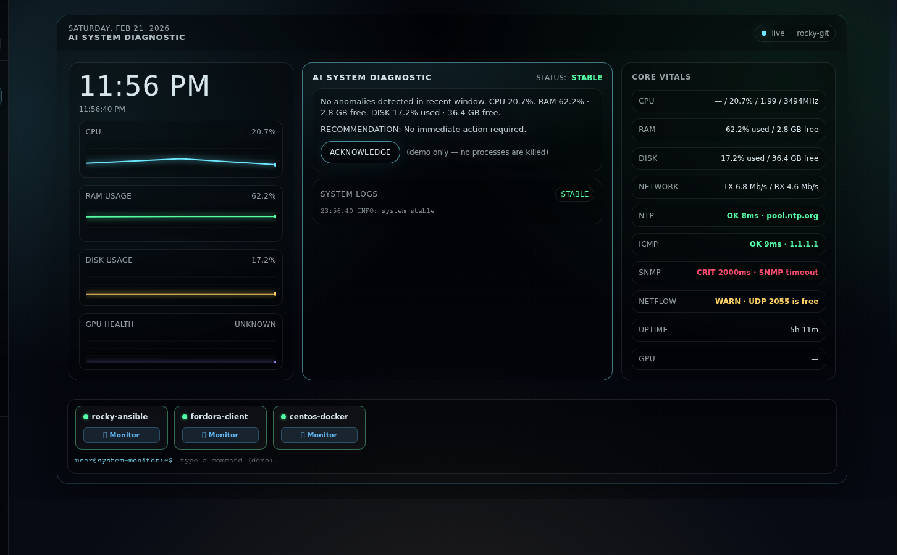

### Problems
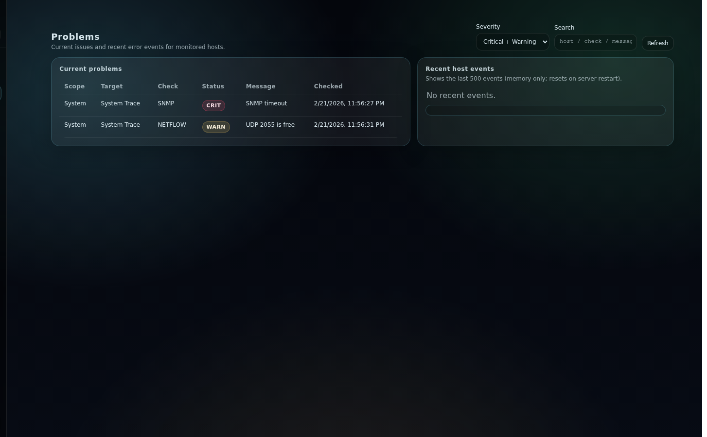

### Hosts
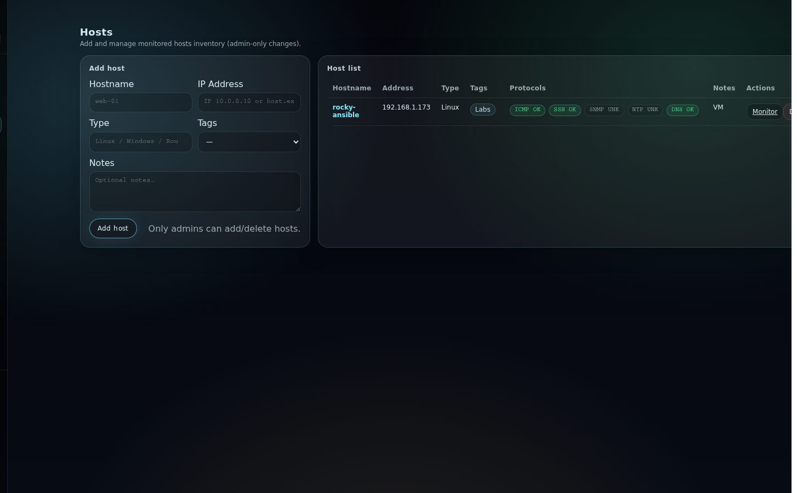

### Maps
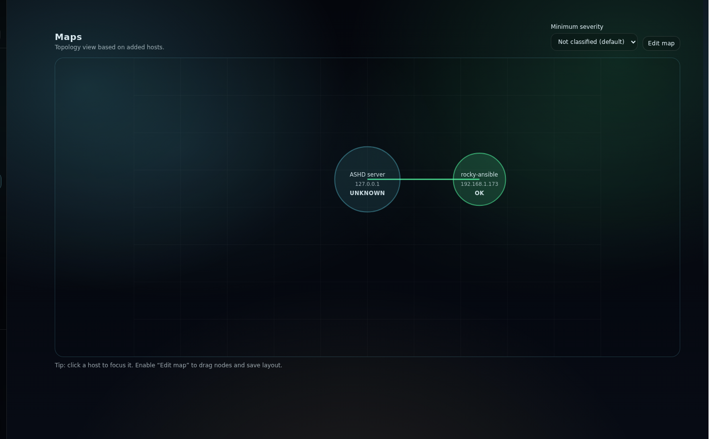

### Inventory
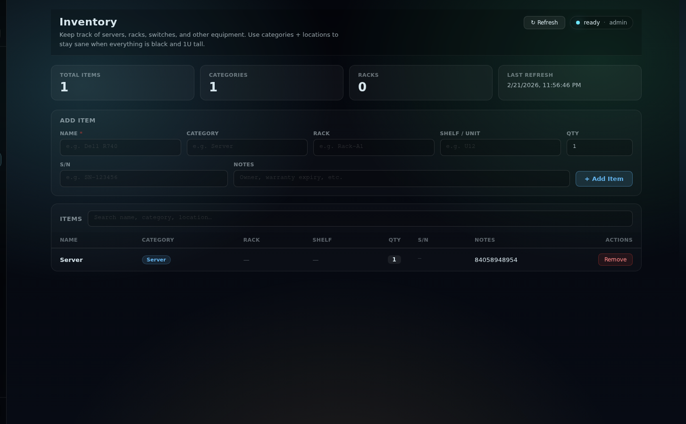

### Overview
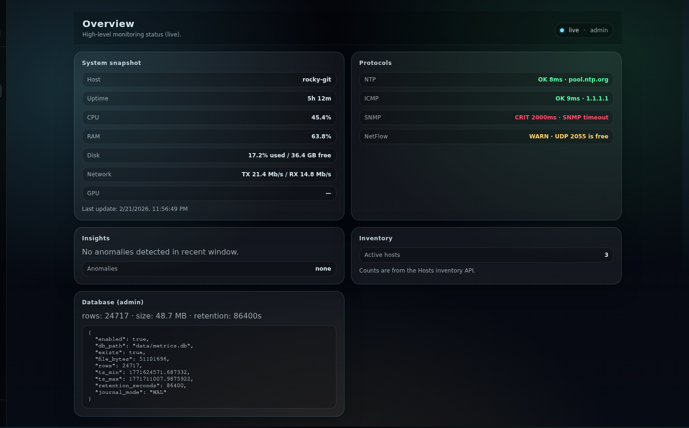

### Configuration
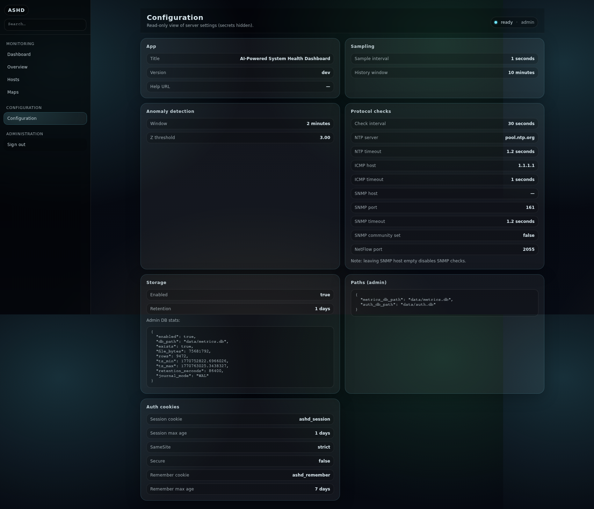

### Hosts Management
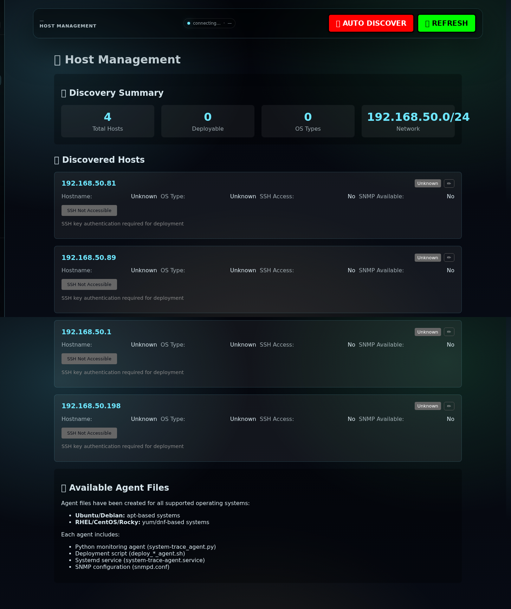

### System Logs
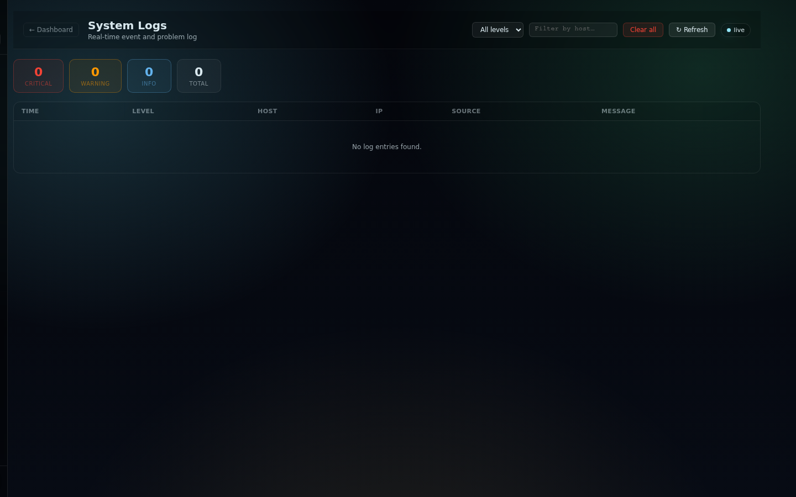

### Users
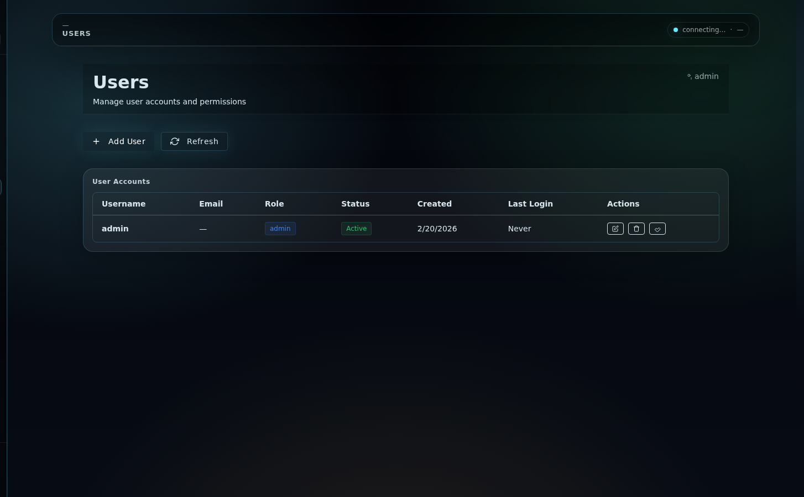

### Host Monitor


## Key Features

### Host Monitor (`/host?id=<id>`)
- Real-time charts updating every ~3 seconds (CPU, RAM, Disk, Network, GPU)
- Frontend rolling ring buffer — 120-point history (2 min at 1s polling)
- **Multi-GPU support** — per-GPU utilization %, VRAM used/total, temperature tiles and charts (via `nvidia-smi`)
- **Problem detection** — header blinks red when CPU ≥ 75%, RAM ≥ 80%, Disk ≥ 85%, GPU ≥ 85%, or agent offline
- **Per-host error history panel** — shows active problems + last 50 log entries for that host
- Protocol checks: ICMP, HTTP, HTTPS, SSH, DNS, SNMP, NTP

### System Logs (`/logs`)
- Auto-logs threshold breaches from agent metrics (CPU, RAM, Disk, GPU util/temp)
- Frontend also reports problems to `/api/logs` when detected on the Host Monitor page
- Filter by level (Critical / Warning / Info) and hostname
- Summary tiles: Critical / Warning / Info / Total counts
- Auto-refreshes every 5 seconds
- Clear all logs button (admin)

### Inventory (`/inventory`)
- Track servers, racks, switches, PDUs, and other equipment
- Fields: **Name**, **Category**, **Rack**, **Shelf/Unit**, **S/N** (serial number), **Qty**, **Notes**
- Summary tiles: Total Items, Categories, Racks, Last Refresh
- Search across all fields
- Admin-only add/remove

### Agents
- Post metrics every **3 seconds** (down from 30s)
- CPU sampling interval: **0.5s**
- GPU metrics via `nvidia-smi` — multi-GPU list with percent, VRAM, temperature
- Supported: Ubuntu, Debian, RHEL, CentOS, Rocky Linux

### System Log API
- `GET /api/logs` — list logs, filterable by `level` and `hostname`
- `POST /api/logs` — write a log entry
- `DELETE /api/logs` — clear all logs (admin)
- `GET /api/logs/host/{hostname}` — per-host log history
- Stored in `data/system_logs.json`, rolling cap of 2000 entries

## Quickstart

### 1) Create a virtualenv + install deps

```bash
cd ai-system-health-dashboard
python -m venv .venv
source .venv/bin/activate
pip install -r requirements.txt
```

### 2) Run

```bash
uvicorn app.main:app --reload --host 0.0.0.0 --port 8000
```

### 3) Open

- Dashboard: http://localhost:8000/
- UI examples: http://localhost:8000/static/ui-examples.html
- API docs: http://localhost:8000/docs

You can also set UI preferences via URL params:

- `/?theme=light&layout=stack&density=compact`

## Configuration

Environment variables (optional):

- `SAMPLE_INTERVAL_SECONDS` (default: `1.0`)
- `HISTORY_SECONDS` (default: `600`)
- `ANOMALY_WINDOW_SECONDS` (default: `120`)
- `ANOMALY_Z_THRESHOLD` (default: `3.0`)

SQLite persistence:

- `METRICS_DB_PATH` (default: `data/metrics.db`) — set to an empty string to disable persistence
- `SQLITE_RETENTION_SECONDS` (default: `86400`) — how long to keep samples in SQLite (set `0` to keep forever)

Example:

```bash
SAMPLE_INTERVAL_SECONDS=0.5 HISTORY_SECONDS=900 SQLITE_RETENTION_SECONDS=172800 uvicorn app.main:app --reload
```

## Authentication (login)

This dashboard includes a simple login system (cookie sessions) with a SQLite users database.

### Required env var

- `SESSION_SECRET_KEY` — required. Set this to a long random string.
	- A starter `.env` file is included (gitignored). Edit it before running.

### Optional env vars

- `AUTH_DB_PATH` (default: `data/auth.db`)
- `SESSION_MAX_AGE_SECONDS` (default: `86400`)
- `SESSION_COOKIE_NAME` (default: `system-trace_session`)
- `SESSION_COOKIE_SAMESITE` (default: `strict`)
- `SESSION_COOKIE_SECURE` (default: `0`) — set to `1` only when serving over HTTPS

### Roles

- `viewer`: can view dashboard + non-admin APIs
- `admin`: can also call `/api/admin/*` endpoints

## Inventory (assets/equipment)

This repo includes a simple **Inventory** page for tracking generic assets (e.g. switches, PDUs, storage systems).

- Page: `GET /inventory`
- APIs:
	- `GET /api/inventory` — list inventory items (any authenticated user)
	- `POST /api/admin/inventory` — add item (admin only)
	- `DELETE /api/admin/inventory/{item_id}` — remove item (admin only)

Inventory items are stored in SQLite alongside the metrics DB (same `METRICS_DB_PATH`).

## Problems + host events

The dashboard has a Problems view (`/#problems`) that shows:

- Current problems derived from host checks + protocol checks
- Recent structured per-host events (failures/recoveries)

API:

- `GET /api/events/recent` — last ~500 in-memory host events (resets on server restart)

## Screenshots (snapshots)

Project UI screenshots are stored under `docs/screenshots/`.

To regenerate them locally, use the helper script:

- `scripts/take_screenshots.py`

It requires Playwright (Chromium). The script reads credentials from env vars so you don't hardcode passwords:

- `System Trace_USER`
- `System Trace_PASS`

### Create users (manual SQLite)

Users are stored in the `users` table inside `AUTH_DB_PATH` (default `data/auth.db`).

If you don't have the `sqlite3` CLI installed, you can use the included helper script instead:

```bash
cd ai-system-health-dashboard
python scripts/manage_users.py list
python scripts/manage_users.py create --username admin --role admin --password 'changeme'
python scripts/manage_users.py set-password --username admin --password 'newpass'
python scripts/manage_users.py set-role --username viewer --role admin
```

1) Generate a PBKDF2 hash for a password:

```bash
cd ai-system-health-dashboard
python -c "from app.auth_storage import auth_storage; print(auth_storage.hash_password('your-password-here'))"
```

2) Insert the user (example admin):

```bash
sqlite3 data/auth.db "INSERT INTO users (username, password_hash, role, is_active, created_at) VALUES ('admin', '<PASTE_HASH_HERE>', 'admin', 1, strftime('%s','now'));"
```

If the DB file doesn't exist yet, start the server once (it will create the table), then insert the user.

## API

### Metrics & Monitoring
- `GET /api/metrics/latest` — latest sample
	- Unauthenticated: `401`
	- `viewer` / `admin`: `200`
- `GET /api/metrics/history?seconds=300`
- `GET /api/insights`
- WebSocket: `ws://localhost:8000/ws/metrics`

### User Management (Admin Only)
- `GET /api/users` — List all users
- `POST /api/users` — Create new user
- `PUT /api/users/{user_id}` — Update user
- `DELETE /api/users/{user_id}` — Delete user
- `GET /api/user-groups` — List all user groups
- `POST /api/user-groups` — Create user group
- `PUT /api/user-groups/{group_id}` — Update user group
- `DELETE /api/user-groups/{group_id}` — Delete user group

### Host Discovery & Deployment
- `GET /api/discovery/results` — Get discovery results
- `GET /api/agent/files/{os_type}` — Get agent files for OS type
- `POST /api/agent/deploy/{host_ip}` — Deploy agent to host

Admin (SQLite):

- `GET /api/admin/db` — DB stats (rows, time range, file size)
	- Unauthenticated: `401`
	- `viewer`: `403`
	- `admin`: `200`
- `POST /api/admin/db/prune` — delete rows older than `SQLITE_RETENTION_SECONDS`
- `POST /api/admin/db/vacuum` — rebuild DB file (may pause briefly)

## Network Monitoring & Agent Deployment

### Auto-Discovery & Multi-Platform Agents

The dashboard now includes comprehensive network monitoring and agent deployment capabilities:

- **Auto-Discovery**: Scans network ranges to discover hosts
- **Multi-Platform Support**: Ubuntu, Debian, RHEL, CentOS, Rocky Linux
- **Non-Root Deployment**: Secure agent deployment with minimal privileges
- **SNMP Monitoring**: Full SNMP v2c support with automatic configuration
- **NTP Synchronization**: Time service management and monitoring

### Quick Start with Agent Deployment

#### 1. Auto-Discover Hosts
```bash
python scripts/auto_discover_hosts.py
```

#### 2. Deploy Non-Root Agent (Recommended)
```bash
# Deploy to centos-docker (192.168.50.198)
./deploy_non_root_centos_docker.sh
```

#### 3. Access Hosts Management
- **Hosts Dashboard**: http://localhost:8001/hosts
- **View discovered hosts and deployment status**
- **Generate deployment commands automatically**

### Agent Features

- **System Metrics**: CPU, memory, disk, network monitoring
- **SNMP Integration**: Full v2c support with automatic configuration
- **NTP Sync**: Time service configuration and monitoring
- **Service Management**: Systemd integration with auto-restart
- **Security**: Non-root deployment with minimal sudo privileges
- **Firewall Config**: Automatic port opening (SNMP:161, NTP:123)

### Supported Operating Systems

| OS | Package Manager | SNMP Service | NTP Service |
|----|----------------|--------------|-------------|
| Ubuntu | apt | snmpd | ntp |
| Debian | apt | snmpd | ntp |
| RHEL | dnf | snmpd | chronyd |
| CentOS | yum | snmpd | chronyd |
| Rocky Linux | dnf | snmpd | chronyd |

### Configuration

Environment variables for network monitoring:

- `SNMP_HOST` - SNMP target host (default: empty)
- `SNMP_PORT` - SNMP port (default: 161)
- `SNMP_COMMUNITY` - SNMP community string (default: public)
- `SNMP_TIMEOUT_SECONDS` - SNMP timeout (default: 5)
- `ICMP_HOST` - ICMP target host (default: 1.1.1.1)
- `ICMP_TIMEOUT_SECONDS` - ICMP timeout (default: 3)
- `NTP_SERVER` - NTP server (default: pool.ntp.org)
- `PROTOCOL_CHECK_INTERVAL_SECONDS` - Check interval (default: 30)

Example configuration:
```bash
SNMP_HOST=192.168.50.198
SNMP_COMMUNITY=public
ICMP_HOST=192.168.50.198
NTP_SERVER=pool.ntp.org
PROTOCOL_CHECK_INTERVAL_SECONDS=30
```

### Troubleshooting

#### SNMP Issues
```bash
# Test SNMP connectivity
snmpwalk -v2c -c public 192.168.50.198 1.3.6.1.2.1.1.1.0

# Check SNMP service
systemctl status snmpd
```

#### NTP Issues
```bash
# Check NTP status
chronyc sources
# or
ntpq -p

# Force NTP sync
chronyc -a makestep
```

#### Agent Issues
```bash
# Check agent service
systemctl status system-trace-agent

# Check agent logs
journalctl -u system-trace-agent -f

# Test agent manually
sudo -u system-trace-agent python3 /home/system-trace-agent/system-trace-agent/system-trace_agent.py
```

### Documentation

- **Agent Deployment Guide**: `AGENT_DEPLOYMENT_GUIDE.md`
- **Non-Root Deployment**: `NON_ROOT_DEPLOYMENT_GUIDE.md`
- **Network Monitoring**: `docs/NETWORK_MONITORING_GUIDE.md`
- **SNMP Configuration**: `docs/SNMP_CONFIGURATION.md`
- **Auto-Discovery Summary**: `auto_discovery_summary.md`

### Scripts Available

- `scripts/auto_discover_hosts.py` - Network discovery
- `scripts/deploy_agents_non_root.py` - Non-root deployment
- `scripts/quick_deploy_agent.py` - Quick deployment
- `scripts/setup_snmp.py` - SNMP configuration
- `scripts/test_snmp_devices.py` - SNMP testing
